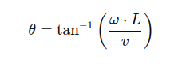

# diff_to_ackermann
This package implements a node to convert differential drive commands to ackermann drive commands. It is based on the interface given in the hunter_se package. 

## Use
Once build, the node can be installed as a systemd service so that it is always up. Before launch the following command, make sure to change the user and the ros domain id in the [diff_to_ack.service](launch/diff_to_ack.service) file to match your needs. 

` ./install_service.sh`

Once the node is running, launch the hunter_se simulation and command interface using two different terminals:  

- ` ros2 launch hunter_se_gazebo hunter_se_empty_world.launch.py `
- ` ros2 run rqt_robot_steering rqt_robot_steering `

change the topic in the command interface from `/cmd_vel` to `/diffdrive_cmd` to activate the conversion of the commands. 

## Algorithm
__Pure Rotation__

An Ackermann drive system cannot physically do a pure rotation. In this converter, the pure rotation is transformed in the following maneuvre: 

1. Robot drives straight ahead
2. Robot drives backwards while turning
3. Robot drives straight ahead again (to go back to the starting position)

_Limitations:_
The duration of the same pure rotation motion is longer for an ackermann drive system than for a differential drive, as it has to maneuvre.

__Otherwise__

When the linear velocity is not null, the angular velocity of a differential drive can be converted to a steering angle using the following formula: 

where theta is the steering angle, w is the angular velocity, L is the wheelbase and v is the linear velocity. 
The linear velocity is identical for both the differential drive and ackermann systems

## Videos 
Videos can be found in the [videos](videos/) folder. Two demonstrations were recorded, one [circle](videos/circle.webm) case and one [pure rotation](videos/pure_rotation.webm) case.
